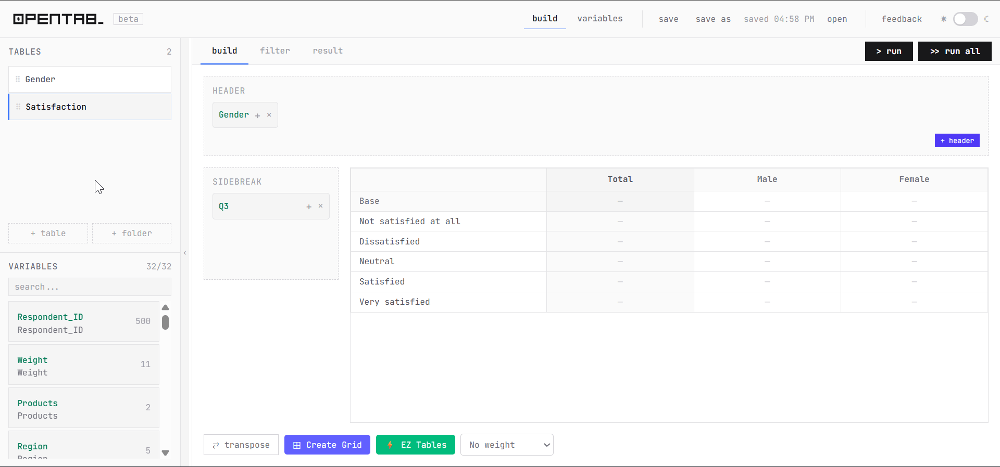

<p align="center">
  
</p>

## About

<p align="center">
  
</p>

opentab_ is an open source interactive reporting tool for survey data. It has a clean, command-line-inspired interface that's straightforward to operate — no formulas, no pivot tables, just drag and drop.

## Themes

opentab now ships with full [Catppuccin](https://github.com/catppuccin/catppuccin) support — switch between all four flavours from the theme button in the navbar, alongside the classic light and dark modes.

| Flavour | Style |
|---|---|
| 🌻 **Latte** | Light, soft pastels |
| 🪴 **Frappé** | Dark, warm tones |
| 🌺 **Macchiato** | Dark, cool ocean |
| 🌿 **Mocha** | Dark, deep and rich |

Each flavour uses a completely distinct accent colour mapping — not just different hex values, but different Catppuccin colours assigned to each UI role.

Powered by [@catppuccin/tailwindcss](https://github.com/catppuccin/tailwindcss). Colour palette © [Catppuccin](https://github.com/catppuccin/catppuccin) — MIT License.

---

## What's New — beta v0.3.0

> **Latest release:** beta v0.3.0 — 9 May 2026

- 🔔 **Auto-update check** — opentab now silently checks for a newer version on startup. If one is available, a banner appears with the update command ready to copy — no need to check GitHub manually
- 🔄 **Update dataset** — swap in a new file without losing tables, edits, or folder structure
- ⚡ **10,000+ variable support** — sidebar, Edit Variables page, EZ Tables, and Create Grid all virtualize their lists; the app stays responsive at any scale
- 🚀 **Faster modals** — EZ Tables and Create Grid open instantly; Edit Variables panel opens without lag
- 🏷️ **SPSS file support improved** — variable labels from `.sav` files now display correctly across the build nesting zone and variable picker
- 📊 **Scale variable support** — continuous/numeric variables (age, score, spend) are auto-detected and display summary stats in the variable panel; drop them to the sidebreak to output Mean, Std Dev, Std Error, and Variance rows in the crosstab
- 🗂️ **Survey tool format support** — datasets from Dimensions, Confirmit, and similar tools using `{_N}` coded format are now loaded and detected correctly out of the box

## Features

- **Drag-and-drop table builder** — Drop variables into Header and Sidebreak zones; supports nested structures up to 3 levels deep
- **EZ Tables Constructor** — Batch-create tables from a shared header template and a list of row variables in one step
- **Saved Headers** — Save a header configuration as a named variable and reuse it across tables with a single drag
- **Run All** — Compute all configured tables in one click with live progress feedback
- **Variable Editor** — Manage codes, labels, visibility, net codes, custom syntax, and factor scores per variable
- **Statistical Summaries** — Per-variable mean, standard error, standard deviation, and variance alongside frequency counts; scale/continuous variables output stat rows directly in the crosstab
- **Filters** — Apply complex AND/OR filter expressions directly to any table
- **Survey Weights** — Weight counts and statistics by any numeric column
- **Grid Mode** — Display a set of variables as a compact variable-grid table
- **Export** — Copy or download results as `.xls` (single table or all tables at once)
- **Session Save / Load** — Export and restore the full workspace as an `.opentab` file
- **Auto-save** — Changes are written back to the open `.opentab` file automatically 2 seconds after each edit (requires File System Access API — Chrome/Edge)
- **Multiple Tables** — Manage many tables with folder organisation in the sidebar
- **Themes** — Light, Dark, and four Catppuccin flavours (Latte, Frappé, Macchiato, Mocha)

## End User Install

> **🎯 Not sure which option to choose?**
> - **Windows/Mac users, first time:** Use [Option 1: Quick Install](#option-1-quick-install-easiest---recommended)
> - **Have other Python apps installed:** Use [Option 2: Virtual Environment](#option-2-using-virtual-environment-safer)
> - **Already have Docker:** Use [Option 3: Docker](#option-3-docker-for-advanced-users)

### Before You Start (Prerequisites)

You need **Python** and **Git** installed before installing opentab.

#### Install Python

**Windows:**
1. Go to https://python.org/downloads
2. Click "Download Python 3.12.x" (the big yellow button)
3. **IMPORTANT:** During installation, check "Add Python to PATH" checkbox!
4. Click "Install Now"

**Mac:**
1. Open Terminal (Cmd + Space, type "Terminal")
2. Install Homebrew (if not installed):
   ```bash
   /bin/bash -c "$(curl -fsSL https://raw.githubusercontent.com/Homebrew/install/HEAD/install.sh)"
   ```
3. Install Python:
   ```bash
   brew install python
   ```

#### Install Git

**Windows:** Download and install from https://git-scm.com/download/win — use all default options.

**Mac:** Run this in Terminal — it will prompt you to install automatically:
```bash
git --version
```

### Option 1: Quick Install (Easiest - Recommended)

**Windows (Command Prompt or PowerShell):**
```bash
pip install git+https://github.com/steviejrdn/opentab.git
opentab
```

> **If `opentab` is not recognized**, run this instead:
> ```bash
> python -m opentab
> ```

**Mac (Terminal):**
```bash
pip3 install git+https://github.com/steviejrdn/opentab.git
opentab
```

> **If `opentab` is not recognized**, run this instead:
> ```bash
> python3 -m opentab
> ```

Your browser will open automatically at http://localhost:8001.

> **Tip:** Use a custom port if 8001 is taken:
> ```bash
> opentab --port 8080
> # or if using the fallback:
> python -m opentab --port 8080
> ```

### Option 2: Using Virtual Environment (Safer)

If you have other Python apps installed, use this method to avoid conflicts:

**Windows:**
```bash
# Create a folder for opentab
mkdir %USERPROFILE%\opentab-app
cd %USERPROFILE%\opentab-app

# Create virtual environment
python -m venv venv

# Activate it
venv\Scripts\activate

# Install opentab
pip install git+https://github.com/steviejrdn/opentab.git

# Run it
opentab
```

**Mac:**
```bash
# Create a folder for opentab
mkdir ~/opentab-app
cd ~/opentab-app

# Create virtual environment
python3 -m venv venv

# Activate it
source venv/bin/activate

# Install opentab
pip install git+https://github.com/steviejrdn/opentab.git

# Run it
opentab
```

### Option 3: Docker (For Advanced Users)

If you already have Docker installed:

```bash
docker run -p 8001:8001 steviejrdn/opentab:latest
```

Then open http://localhost:8001 in your browser.

### Updating to a New Build

When a new build is released, run this to update:

**Windows:**
```bash
pip install --upgrade git+https://github.com/steviejrdn/opentab.git
```

**Mac:**
```bash
pip3 install --upgrade git+https://github.com/steviejrdn/opentab.git
```

---

### Common Issues & Troubleshooting

**"'opentab' is not recognized" error (Windows)**
- pip installed to a user folder that isn't in PATH. Use `python -m opentab` instead, or add `%APPDATA%\Python\Python3xx\Scripts` to your PATH environment variable

**"'pip' is not recognized" error (Windows)**
- Python wasn't added to PATH. Reinstall Python and check "Add Python to PATH"

**"'git' is not recognized" error**
- **Windows:** Install Git from https://git-scm.com/download/win
- **Mac:** Run `git --version` in Terminal, it will prompt to install

**"Permission denied" error (Mac)**
- Use `pip3 install --user git+https://github.com/steviejrdn/opentab.git` instead

**Port 8001 already in use**
- Another app is using port 8001. Use a different port:
  ```bash
  opentab --port 8080
  ```
- Or close the other app using port 8001

**Need help?**
- 📖 Check the [User Guide](https://github.com/steviejrdn/opentab/wiki)
- 🐛 [Report an issue](https://github.com/steviejrdn/opentab/issues)

## Developer Quick Start (Docker)

**For developers who want to contribute or modify the code.**

**Prerequisites:** [Docker](https://www.docker.com/products/docker-desktop) and Docker Compose

```bash
git clone https://github.com/steviejrdn/opentab.git
cd opentab
docker-compose up
```

- Backend (FastAPI + hot reload): http://localhost:8001
- Frontend (Vite + React + hot reload): http://localhost:5173

Stop with `Ctrl+C`.

## Local Development (without Docker)

### Requirements

- **Backend**: Python 3.11+, pip
- **Frontend**: Node.js 20+, npm

### Setup Backend

```bash
pip install -e .
uvicorn opentab.main:app --reload --port 8001
```

Backend API docs: http://localhost:8001/api/docs

### Setup Frontend

```bash
cd frontend
npm install
npm run dev
```

Frontend runs on http://localhost:5173

## Architecture

### Backend (FastAPI)
- **Entry**: `opentab/main.py`
- **Core modules**: `opentab/core/` — cross-tabulation, statistics, data parsing
- **API routes**: `/api/data`, `/api/tables`, `/api/compute`

### Frontend (React + TypeScript + Vite)
- **Entry**: `frontend/src/App.tsx` (single-page app)
- **State management**: Zustand (`frontend/src/store/useStore.ts`)
- **Drag-and-drop**: dnd-kit
- **Styling**: Tailwind CSS

## Usage

1. **Upload data** — CSV/TXT file (auto-detects encoding/delimiter)
2. **Define variables** — Add labels, codes, statistics toggles
3. **Build table** — Drag variables to Header/Sidebreak zones
4. **Run** — Click "Run" to compute crosstab
5. **Save** — Export session as `.opentab` file; subsequent changes are auto-saved every 2 seconds

## File Structure

```
opentab/
├── opentab/
│   ├── main.py              # FastAPI entry
│   ├── cli.py               # `opentab` CLI entry point
│   ├── requirements.txt
│   ├── Dockerfile
│   ├── api/                 # Route handlers
│   └── core/                # Core logic
│       ├── tabulator.py     # Crosstab builder
│       ├── code_parser.py   # Code expression parser
│       ├── statistics.py    # Frequency/stats calc
│       └── data_loader.py   # CSV loader
├── frontend/
│   ├── src/
│   │   ├── App.tsx          # Main component
│   │   ├── store/           # Zustand store
│   │   ├── lib/             # API clients
│   │   └── ...
│   ├── package.json
│   ├── vite.config.ts
│   └── Dockerfile
├── pyproject.toml           # Package config (pip install)
├── docker-compose.yml       # Docker Compose config
└── README.md                # This file
```

## Environment Variables

### Backend
- `PYTHONUNBUFFERED=1` — Stream logs in Docker

### Frontend
- `VITE_API_URL` — Backend API URL (default: `http://localhost:8001`)

## API Endpoints

### Data Management
- `POST /api/data/upload` — Upload CSV
- `GET /api/data/sample` — Load sample data
- `GET /api/data/variables` — Get variable metadata

### Crosstabs
- `POST /api/compute/crosstab` — Compute crosstab with filters, weights, stats

## Building for Production

Build the frontend into the package static dir, then serve everything from one process:

```bash
cd frontend && npm install && npm run build && cd ..
pip install -e .
opentab
```

## Contributing

Contributions welcome! Please:
1. Fork the repo
2. Create a feature branch (`git checkout -b feat/your-feature`)
3. Commit changes
4. Push to branch
5. Open a Pull Request

## License

- Source code Licensed under MIT License — see LICENSE file
- opentab_ logo and all graphical assets Licensed under [CC BY-NC-ND 4.0](https://creativecommons.org/licenses/by-nc-nd/4.0/)

## Support

- 📖 [Project Docs](./CLAUDE.md) — Architecture & development guide
- 🐛 [Issues](https://github.com/steviejrdn/opentab/issues) — Report bugs or request features
- 💬 Discussions — Ask questions

## Built With

This app is vibe coded using [Claude Code](https://claude.ai/code) and [OpenCode](https://opencode.ai).

---

## Changelog

### beta v0.3.0 *(9 May 2026)*

- **Feature:** Auto-update check — on startup, opentab silently fetches the latest version from the main branch. If a newer version is available, a banner appears below the navigation bar showing the current and latest versions, with the pip install command ready to copy. The banner only appears for pip-installed users; dev mode is unaffected
- **Feature:** Scale/continuous variable support — numeric variables with more than 10 distinct values (e.g. age, spend, score) are auto-detected as `scale` type across CSV, XLSX, and SAV files. SPSS `variable_measure = scale` is also respected for variables with fewer distinct values. The variable panel shows summary statistics (min, max, mean, median, std dev, N) instead of a code list. Dropping a scale variable to the sidebreak outputs stat rows (Mean, Std Dev, Std Error, Variance) per banner column — with no code-based rows. Each stat can be toggled individually. The build-tab preview shows amber stat row placeholders matching the result layout
- **Feature:** Update dataset without losing your work — swap in a new CSV, XLSX, or SAV file from the settings panel while keeping all existing tables, variable edits, and folder structure intact. Columns missing from the new file are flagged automatically
- **Performance:** Variable sidebar now virtualizes rendering — only visible items are in the DOM, making the app stay responsive even with 10,000+ variable datasets
- **Performance:** Edit Variables page virtualizes table rows and adds a search filter — opening and closing the variable editor panel is instant even with 10,000+ variable datasets
- **Performance:** EZ Tables and Create Grid modals virtualize their variable lists — both open instantly regardless of dataset size
- **Performance:** EZ Tables modal is now an independent component — opening it no longer re-renders the build zone, eliminating lag when a table is active
- **Performance:** Weight column selector now only lists numeric variables, eliminating thousands of DOM nodes on modal open
- **Performance:** Large SAV file loading is significantly faster — string conversion is now vectorized instead of calling a Python function per cell
- **Performance:** Crosstab computation no longer copies the full dataframe — only the columns needed for mean score calculation are copied, reducing memory overhead on wide datasets
- **Performance:** Crosstab computation is faster on weighted data — the weight column is now cast to float once before the row×column loop instead of once per cell
- **Performance:** UI interactions (drag, build zone updates) are smoother — expensive label-lookup and code-registry functions are now memoized and only recompute when variable definitions change, not on every render
- **Performance:** Merge variable operations (dichotomous, spread, OR/AND) are significantly faster on large datasets — row-by-row `.at[]` loops replaced with vectorized pandas operations
- **Feature:** Survey tool coded format support (`{_N}`) — datasets exported from tools like Dimensions/Confirmit use `{_1}`, `{_2}` for single-answer codes and `{_1,_2,_3}` for multiple-answer. opentab now detects and normalizes this format automatically at load time — no manual conversion needed. Multiple-answer variables in this format are detected correctly without relying on semicolons
- **Feature:** Open-ended/text column detection — free-text columns, date fields, and ID columns are now classified as `text` type and excluded from code-based analysis
- **UX:** Version number (`v0.3.0`) now displayed in the navigation bar alongside the beta badge
- **Fix:** Build nesting items now correctly show SPSS variable labels for `.sav` files — variable key in green, SPSS label as grey sub-text (was showing the key twice when no distinct label was set)
- **Fix:** Variable picker inside the nesting modal now shows SPSS labels in grey parentheses next to the variable key
- **UX:** Loading screen now shows a progress bar with phase-aware text ("Twerking..." → "Loading variable list...") so it's clear the app is working and not frozen

---

**Made with ❤️ from market researcher to another**
